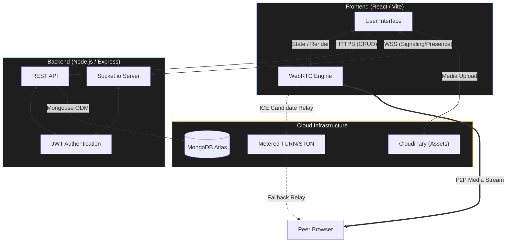

<div align="center">
  
  <h1>🚀 TalkToMe</h1>
  <p><strong>Enterprise-Grade Real-Time Messaging & WebRTC Group Calling Platform</strong></p>

  <p>
    <a href="https://talk-to-me-pied.vercel.app/" target="_blank">View Live Demo</a> ·
    <a href="https://github.com/Harshkumar2306/talk-to-me/issues" target="_blank">Report Bug</a> ·
    <a href="https://github.com/Harshkumar2306/talk-to-me/issues" target="_blank">Request Feature</a>
  </p>

  <p>
    
    
    
    
    
    
    
  </p>
</div>

---

## 📖 Overview

**TalkToMe** is an ultra-premium, highly scalable real-time messaging application engineered with the MERN stack and WebRTC. Designed to mirror the seamless UX of modern messaging apps like WhatsApp and Discord, it features state-of-the-art multi-network NAT traversal for flawless Peer-to-Peer (P2P) group video and audio calls on any connection.

Whether you're on a restrictive corporate firewall or a mobile cellular network, TalkToMe's robust signaling and fallback TURN architecture ensures you stay connected.

### 🌐 Live Deployment
- **Frontend (Vercel):** [https://talk-to-me-pied.vercel.app/](https://talk-to-me-pied.vercel.app/)
- **Backend API (Render):** [https://talk-to-me-1-jhl1.onrender.com](https://talk-to-me-1-jhl1.onrender.com)

---

## ✨ Core Features

### 📞 WebRTC Mesh Group Calling
- **Multi-Participant Video/Audio:** Fully functional mesh topology supporting multiple concurrent users in a single room.
- **Adaptive Grid Layout:** UI automatically scales and recalculates participant video feeds dynamically.
- **Hardware Controls:** Instant local media stream toggling (mute audio/disable video) with real-time UI synchronization.

### 🛡️ Advanced NAT Traversal (Metered TURN)
- **Seamless Connectivity:** Bypasses symmetric NATs and aggressive firewalls (e.g., strict cellular networks, corporate Wi-Fi).
- **ICE Candidate Routing:** Automatically generates and tests multiple routing paths, including Port 443 TCP/TLS fallbacks, to guarantee connection reliability.

### ⚡ Real-Time Messaging & Presence Engine
- **Live Status Tracking:** Precisely tracks user presence, handling multi-tab session states to prevent false "Offline" broadcasts. Detects backgrounding/locking instantly.
- **Optimistic UI Updates:** Zero-latency message dispatching. Messages appear instantly in the UI before the server even acknowledges them.
- **Read Receipts Engine:** Granular tracking for Sent (1 tick), Delivered (2 gray ticks), and Read (2 blue ticks) states.
- **Typing Indicators:** Real-time animated typing bubbles broadcasted via WebSockets.

### 📂 Rich Media Sharing
- **Cloudinary Integration:** High-speed uploads for images, documents, and other file types.
- **Voice Notes:** Built-in browser audio recording for quick voice messaging.

### 🎨 Ultra-Premium UI/UX
- **Modern Aesthetics:** Beautiful dark mode implementation featuring sleek glassmorphism, glowing orbs, and bespoke typography.
- **Fluid Animations:** Powered by Framer Motion for buttery-smooth modal interactions, message bubbles, and layout transitions.
- **Fully Responsive:** Tailored experiences for both desktop power-users and mobile devices.

---

## 🏗️ System Architecture

TalkToMe operates on a decoupled architecture, leveraging WebSockets for real-time signaling and WebRTC for decentralized media streaming.



---

## 🚀 Getting Started (Local Development)

Follow these instructions to set up the project locally for development and testing.

### Prerequisites
- Node.js (v18.0.0 or higher)
- npm or yarn
- MongoDB Atlas Account (or local MongoDB instance)
- Cloudinary Account
- Metered.ca Account (for WebRTC TURN servers)

### 1. Clone the Repository
```bash
git clone https://github.com/Harshkumar2306/talk-to-me.git
cd talk-to-me
```

### 2. Configure Environment Variables

**Backend (`backend/.env`):**
```env
PORT=5001
MONGO_URI=your_mongodb_connection_string
JWT_SECRET=your_super_secret_jwt_key
NODE_ENV=development
CLOUDINARY_NAME=your_cloud_name
CLOUDINARY_API_KEY=your_api_key
CLOUDINARY_API_SECRET=your_api_secret
```

**Frontend (`frontend/.env`):**
```env
VITE_BACKEND_URL=http://127.0.0.1:5001
VITE_TURN_URL=turn:global.relay.metered.ca:80
VITE_TURN_USERNAME=your_metered_username
VITE_TURN_CREDENTIAL=your_metered_password
```

### 3. Install Dependencies & Run

We recommend running the frontend and backend in separate terminal windows.

**Terminal 1 (Backend):**
```bash
cd backend
npm install
npm run dev
```
*The backend API will initialize on `http://localhost:5001`.*

**Terminal 2 (Frontend):**
```bash
cd frontend
npm install
npm run dev
```
*The frontend dashboard will be available at `http://localhost:5173`.*

---

## ☁️ Cloud Deployment Guidelines

TalkToMe is optimized for modern PaaS providers.

### Backend (Render / Heroku)
1. Push the repository to your GitHub.
2. Create a new **Web Service** on Render and connect the repository.
3. Set the **Root Directory** to `backend`.
4. Define the Build Command: `npm install`
5. Define the Start Command: `npm start`
6. Input all backend `.env` variables in the Render dashboard.
7. Deploy!

### Frontend (Vercel / Netlify)
1. Import the repository into Vercel.
2. Set the **Root Directory** to `frontend`.
3. Vercel will automatically detect Vite. Leave build commands as default (`npm run build`).
4. Input all frontend `.env` variables, ensuring `VITE_BACKEND_URL` points to your newly deployed Render URL.
5. Deploy!

---

## 📂 Repository Structure

```text
talk-to-me/
├── backend/
│   ├── config/            # DB connection & Seeders
│   ├── controllers/       # Business logic for APIs
│   ├── middleware/        # JWT Verification & Error catching
│   ├── models/            # Mongoose Schemas (User, Chat, Message)
│   ├── routes/            # Express endpoint definitions
│   └── server.js          # Entry point, Socket.io, & Presence Engine
│
├── frontend/
│   ├── public/            # Static assets (Favicons, Logos)
│   ├── src/
│   │   ├── components/    # Modular React UI (ChatBox, Sidebar, Modals)
│   │   ├── Context/       # Global State (ChatProvider, CallProvider)
│   │   ├── pages/         # High-level route views (HomePage, ChatPage)
│   │   ├── App.jsx        # React Router configuration
│   │   └── index.css      # Tailwind core & custom keyframe animations
│   ├── tailwind.config.js # Theme tokens and plugins
│   └── vite.config.js     # Bundler configuration
│
└── README.md
```

---

## 🤝 Contributing
Contributions, issues, and feature requests are highly encouraged! 
Feel free to check the [issues page](https://github.com/Harshkumar2306/talk-to-me/issues) if you want to contribute.

## 📝 License
This project is licensed under the **MIT License**. See the `LICENSE` file for more details.

---
<div align="center">
  <sub>Built with ❤️ for real-time communication.</sub>
</div>
