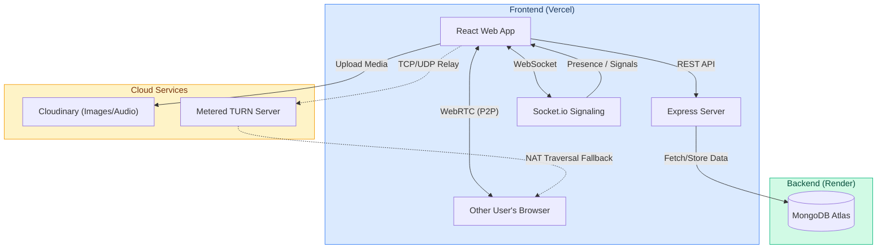

# 🚀 TalkToMe: Real-Time Chat & Group Call Platform

An ultra-premium, real-time messaging and group video calling application built with the MERN stack and WebRTC. Designed with a WhatsApp-style interface, it features seamless multi-network NAT traversal for flawless calls on any connection.

Built using **MongoDB, Express, React, Node.js, Socket.io, and simple-peer**.

### 🌟 Live Demo
*(Replace these links with your actual deployed URLs)*
- 🌐 **Frontend:** https://talk-to-me.vercel.app/
- ⚙️ **Backend API:** https://talk-to-me.onrender.com

---

## 🏗️ System Architecture



---

## 🌟 Features & Architecture

### 1. WhatsApp-Style Group Video & Audio Calls
- Fully functional WebRTC mesh topology for multi-user group calls.
- Adaptive grid layout (section per person) that scales beautifully based on the number of participants.
- Local stream previews, mute audio, and disable video controls.

### 2. Multi-Network NAT Traversal (Metered TURN Integration)
- Connect seamlessly across strict cellular networks (like Jio, Airtel) and corporate WiFis.
- Automatically generates and tests multiple ICE candidate fallback routes, including **Port 443 TCP/TLS**, to bypass symmetric NATs and aggressive firewalls.

### 3. Real-Time Online Presence & Status Tracking
- **Live Visibility Tracking:** Instantly tracks when a user backgrounds the app or locks their phone, immediately updating their status to "Offline".
- **Multi-Tab Support:** Accurately calculates active sessions across multiple tabs to prevent false "Offline" broadcasts.
- Green dot indicators and "Online" text rendered in real-time without page refreshes.

### 4. Advanced Real-Time Messaging Engine
- **Typing Indicators:** Real-time animated typing bubbles.
- **Read Receipts:** WhatsApp-style ticks for Sent (1 tick), Delivered (2 gray ticks), and Read (2 blue ticks).
- **File & Media Sharing:** Image, document, and audio sharing powered by Cloudinary.
- **Voice Notes:** Built-in audio recorder for quick voice messages.

### 5. Ultra-Premium React UX/UI
- Built with React, Vite, Tailwind CSS, and Framer Motion.
- Beautiful dark mode optimization with sleek glassmorphism effects and modern typography.
- Fluid micro-animations for incoming call modals, message bubbles, and UI transitions.

---

## 🛠️ Local Setup & Testing

### Prerequisites
- Node.js 18+
- MongoDB Atlas account (free tier)
- Cloudinary account (for media uploads)
- Metered.ca account (for WebRTC TURN servers)

### 1. Set Up Environment Variables
Create a `.env` file in the **backend** folder:
```env
PORT=5001
MONGO_URI=your_mongodb_connection_string
JWT_SECRET=your_jwt_secret
NODE_ENV=development
CLOUDINARY_NAME=your_cloud_name
CLOUDINARY_API_KEY=your_api_key
CLOUDINARY_API_SECRET=your_api_secret
```

Create a `.env` file in the **frontend** folder:
```env
VITE_BACKEND_URL=http://127.0.0.1:5001
VITE_TURN_URL=turn:global.relay.metered.ca:80
VITE_TURN_USERNAME=your_metered_username
VITE_TURN_CREDENTIAL=your_metered_password
```

### 2. Run Backend
```bash
cd backend
npm install
npm run dev
```
*The API will be available at http://localhost:5001.*

### 3. Run Frontend
```bash
cd frontend
npm install
npm run dev
```
*The dashboard will be available at http://localhost:5173.*

---

## ☁️ Cloud Deployment (Render + Vercel)

### 1. Backend Deployment (Render)
1. Push this repository to GitHub.
2. Go to **Render** → New Web Service → Connect your repo.
3. Set the Root Directory to `backend`.
4. Add all Backend Environment Variables (MONGO_URI, JWT_SECRET, etc.).
5. Click **Deploy**. Copy the live backend URL.

### 2. Frontend Deployment (Vercel)
1. Go to **Vercel** → Add New Project → Select your repo.
2. Set the Root Directory to `frontend`.
3. Add your Environment Variables:
   - `VITE_BACKEND_URL` = `https://your-backend.onrender.com`
   - `VITE_TURN_URL`, `VITE_TURN_USERNAME`, `VITE_TURN_CREDENTIAL`
4. Click **Deploy**!

---

## 📁 Project Structure

```text
talk-to-me/
├── backend/
│   ├── models/            # Mongoose schemas (User, Chat, Message)
│   ├── controllers/       # API route logic
│   ├── routes/            # Express router definitions
│   ├── middleware/        # JWT Auth and Error handling
│   └── server.js          # Socket.io setup, WebRTC signaling & Presence Engine
├── frontend/
│   ├── src/
│   │   ├── components/    # Reusable UI (ChatBox, Sidebar, Modals)
│   │   ├── Context/       # Zustand/React Context (ChatProvider, CallProvider)
│   │   ├── pages/         # HomePage, ChatPage
│   │   ├── App.jsx        # Routing
│   │   └── index.css      # Tailwind directives & custom animations
│   ├── tailwind.config.js
│   └── vite.config.js
└── README.md
```

---

## 🤝 Contributing
Contributions, issues, and feature requests are welcome! Feel free to check the issues page.

## 📝 License
This project is licensed under the MIT License.
